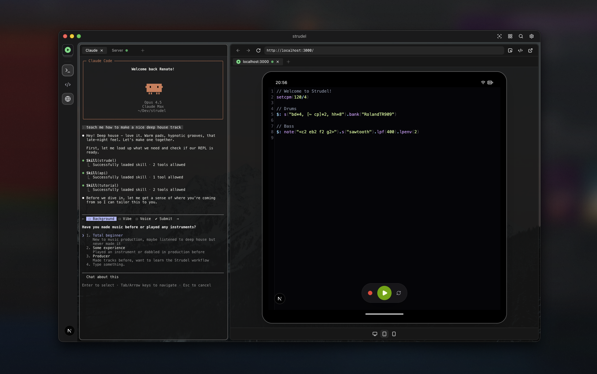

# strudel-claude



An experiment to play and learn [Strudel](https://strudel.cc) with Claude Code.

A minimal, full-screen live coding environment for making music. **Built for AI** - exposes REST APIs so Claude can compose and control music programmatically.

## What is Strudel?

Strudel is a JavaScript port of Tidal Cycles for algorithmic music composition. Write code, make music, in real-time.

```javascript
// Drums
$: s("bd*4, [~ cp]*2, hh*8").bank("RolandTR909")

// Bass
$: note("<c2 eb2 f2 g2>").s("sawtooth").lpf(400)
```

## Prerequisites

- [Claude Code](https://docs.anthropic.com/en/docs/claude-code) installed

## Quick Start

**1. Start the server**
```bash
npm install
npm run dev
```

**2. Open Claude Code in the project folder**
```bash
claude
```

**3. Ask for any skill**
```
"Teach me Strudel"          → /tutorial
"Play me a techno set"      → /dj-set
"Compose a synthwave track" → /compose
"Let's make music together" → /interactive
```

See [Skills for Claude Code](#skills-for-claude-code) for more examples.

## Keyboard Shortcuts

| Shortcut | Action |
|----------|--------|
| `Cmd+Enter` | Play / evaluate code |
| `Cmd+.` | Stop |

## Recording Audio

Capture your Strudel output to WAV:

1. **Start playback** - Hit play or `Cmd+Enter`
2. **Click the red record button** - It pulses and shows duration
3. **Click again to stop** - A preview toast appears
4. **Listen, then Download or Discard**

Recording is independent from playback - stop recording anytime without stopping the music.

## API for Agents

The REST API allows AI agents to read and write Strudel code, enabling autonomous music composition. **Real-time sync** via Server-Sent Events means the browser updates instantly when you push code or trigger playback.

| Endpoint | Method | Description |
|----------|--------|-------------|
| `/api/code` | `GET` | Get current code and playing state |
| `/api/code` | `POST` | Push new code `{ "code": "..." }` |
| `/api/play` | `POST` | Start playback |
| `/api/stop` | `POST` | Stop playback |
| `/api/status` | `GET` | Get current state |
| `/api/events` | `GET` | SSE stream for real-time updates |

### Example: AI Composing Music

```bash
# Push new code and play
curl -X POST http://localhost:3000/api/code \
  -H "Content-Type: application/json" \
  -d '{"code": "$: s(\"bd*4, cp*2\").bank(\"RolandTR909\")"}'

curl -X POST http://localhost:3000/api/play
```

## Project Structure

```
src/
├── app/
│   ├── api/                # REST API for agents
│   │   ├── code/           # GET/POST code
│   │   ├── events/         # SSE stream
│   │   ├── play/           # POST play
│   │   ├── stop/           # POST stop
│   │   ├── status/         # GET status
│   │   └── state.ts        # Shared state + event emitter
│   ├── layout.tsx          # Root layout
│   ├── page.tsx            # Home page
│   └── globals.css         # Styles + CodeMirror theme
├── components/
│   └── strudel-editor.tsx  # Main editor
├── hooks/
│   ├── use-strudel.ts      # Strudel lifecycle + SSE sync
│   └── use-audio-recorder.ts # Audio recording to WAV
└── lib/
    ├── constants.ts        # Shared constants
    ├── utils.ts            # Utilities
    └── wav-encoder.ts      # Pure JS WAV encoder
```

## Tech Stack

- Next.js
- Tailwind CSS
- Strudel REPL

## Voice Feedback (macOS only)

The AI agent uses the `say` command for voice feedback. This only works on macOS.

By default, macOS uses basic voices like Daniel or Samantha, but you can enable much better **Siri voices** that sound way more natural:

### Enable Siri Voices

1. Open **System Settings** → **Accessibility** → **Spoken Content**
   *(or press `Cmd+Space` and search "Spoken Content")*
2. Click the **ⓘ** (info icon) next to **System Voice**
3. In the voice dropdown, search for **"Siri"**
4. Download a Siri voice you like
5. **Set it as your System Voice** - this way all `say` commands use it automatically

Test it in Terminal:

```bash
say "Let's make some music"
```

## Skills for Claude Code

This REPL includes skills that teach Claude how to make music. The `/strudel` and `/api` skills are loaded automatically - Claude already knows the syntax and how to control the app.

**Try these:**

### `/tutorial` - Learn Strudel & Music Theory

```
"Teach me Strudel from the beginning"
"Explain how filters work"
"Show me how to make chord progressions"
"Teach me music theory basics"
"What's the difference between major and minor scales?"
```

### `/dj-set` - Live DJ Sets

```
"Play me a 5-minute live techno set"
"Create a deep house journey"
"Do a chill ambient set with voice narration"
"Play an indefinite acid house set until I stop you"
```

### `/compose` - Full Track Compositions

```
"Compose a 3-minute synthwave track"
"Create a full UK garage song"
"Make a lo-fi hip hop beat"
```

### `/interactive` - Guided Music Creation

```
"Let's make music together"
"Help me create a beat"
"Guide me through making a song"
```

### Other Skills

- `/visuals` - Add visualizations (pianoroll, spiral, oscilloscope)
- `/strudel` - Syntax reference (loaded automatically)
- `/api` - REPL control (loaded automatically)

## Learn More

- [Strudel Docs](https://strudel.cc/learn)
- [Strudel GitHub](https://github.com/tidalcycles/strudel)
- [Tidal Cycles](https://tidalcycles.org)

## License

MIT - Free to use, copy, modify, and distribute.

---

Made in [Blueberry](https://meetblueberry.com) 🫐
